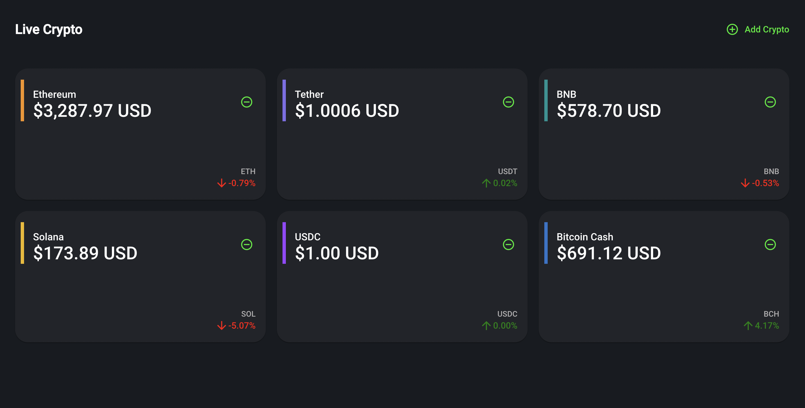

# Live Crypto

Dashboard for showing main crypto currencies rate 🪙💸

## Table of Contents 𝌞

- [Installation](#installation-)
- [Technologies](#technologies-)
- [Development](#development-)
  - [Development server](#development-server-)
  - [Build](#build-)
- [Testing](#testing-)
- [Final Result](#final-result-)
- [License](#license-)

## Installation 💾

1. Clone the repository:

   ```sh
   git clone https://github.com/laubeltranb1/live-crypto.git
   ```

2. Install Dependencies:
   ```sh
   cd your-repository
   npm install
   ```

## Technologies 🖥

- Angular v15.2
- Material v15.2.0
- NodeJS v20.11.0
- Socket.IO 4.4.0

## Development 📘

#### Development server

Run `ng serve` for a dev server. Navigate to http://localhost:4200/. The app will automatically reload if you change any of the source files.

#### Build 👷🏼‍♀️

Run `ng build` to build the project. The build artifacts will be stored in the dist/ directory.

Use the `--prod` flag for a production build.

## Testing 🧪

Run `ng test` to execute the unit tests via Karma.

Run `ng test --code-coverage` to execute the code coverage of testing.

Run `ng e2e` to execute the end-to-end tests via Protractor.

#### Test Coverage

Set to 75% - in karma.config.js

(Excluding Dashboard Test)


## Final Result 📊



## License 🪪

